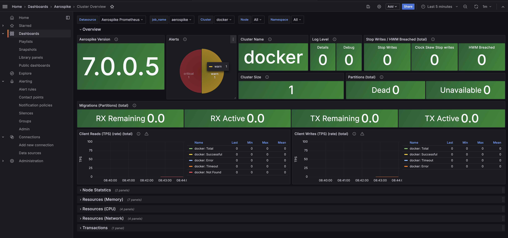
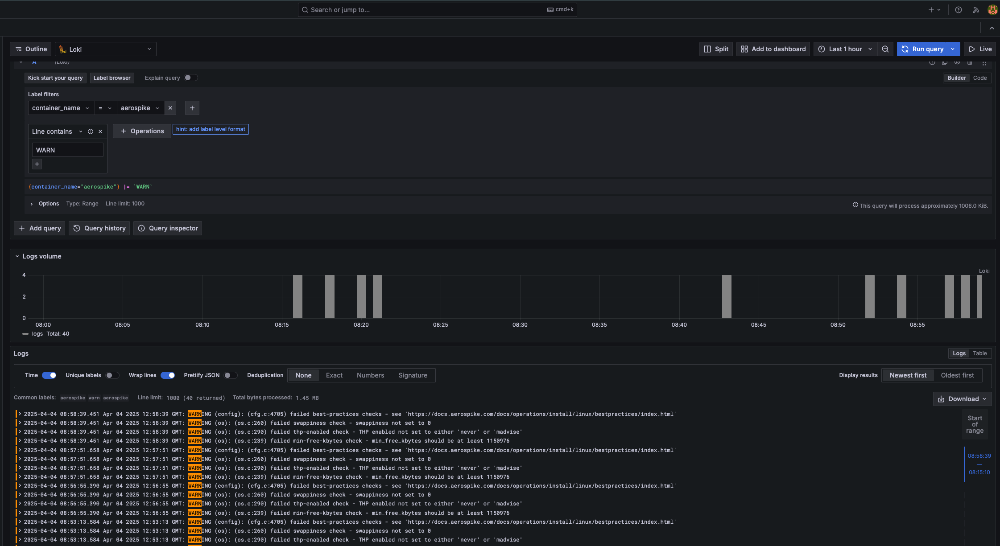

# Quick Start: Aerospike Monitoring Stack

This setup will create a single-node Aerospike cluster and deploy a monitoring stack using a simple `docker-compose` file.

## Prerequisites

- Docker
- Docker Compose

## Getting Started

### Start the Stack

To start the stack, run the following command:

```sh
docker-compose up
```

### Access the Dashboard

Once the stack is up, open your browser and navigate to `http://localhost:4000/dashboards` to access the Grafana dashboard.

- **Username:** admin
- **Password:** admin


### Cluster Dasboard

🧠 Purpose of the Dashboard

This dashboard gives operators and SREs a comprehensive, real-time overview of Aerospike database clusters. It’s powered by Prometheus metrics and visualized via Grafana panels.

It focuses on:
•	Cluster health & versioning
•	Alerts
•	Cluster size
•	Write stop flags
•	Migrations
•	Client read/write TPS
•	Memory, CPU, and network usage


### Explore Logs with Loki




1. In the Grafana navigation menu, click on **Explore**.
2. Select **Loki** as the data source.
3. Use the following label filters to view logs:
    - `container_name`
    - `aerospike`
4. To filter logs containing warnings, type `WARN` in the search line and run the query.


## Stopping the Stack

To stop the stack, run the following command:

```sh
docker-compose down 
```
Also Control + C to shutdown docker compose

## Additional Information

For more details on configuration and customization, refer to the respective configuration files in the `config` directory.
